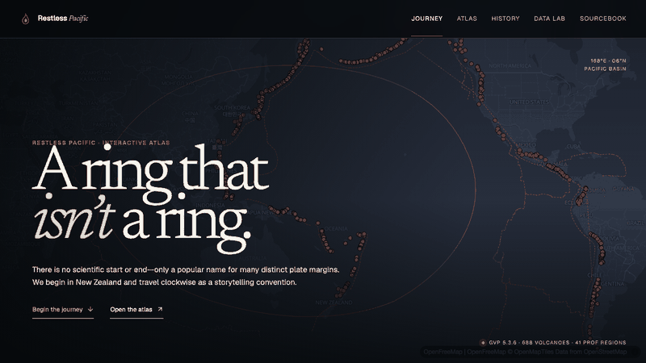
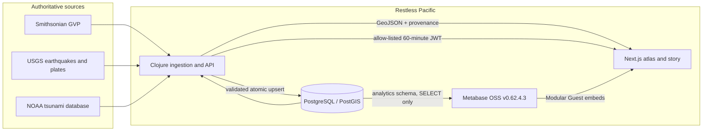

# Restless Pacific

**An interactive atlas of the Ring of Fire — and an argument for why it is not really a ring.**

Restless Pacific is a public Developer Advocate portfolio project built around a
full-bleed Pacific map, a sourced editorial journey, and an embedded Metabase
data lab. Clojure owns ingestion, provenance, spatial APIs, and guest-token
signing. PostgreSQL/PostGIS is the shared analytical store. Next.js owns the
story and map experience. Metabase OSS owns the reusable analytical views.



The project begins its guided tour in New Zealand and travels clockwise as a
storytelling convention. That is not a scientific start point: the Smithsonian
describes the “Ring of Fire” as a popular term rather than one continuous
geologic structure. Membership is therefore stored as versioned evidence, not
as an intrinsic property of a volcano.

## Run it

Prerequisites: Docker Desktop or Docker Engine with Compose v2, GNU/BSD Make,
and roughly 8 GB of available memory for the complete stack.

The pinned official PostGIS image is currently amd64-only. `.env.example` sets
`POSTGRES_PLATFORM=linux/amd64`, so Docker Desktop uses emulation on Apple
Silicon; the production VPS target is amd64. First startup can therefore be
slower on an ARM Mac.

```sh
make dev
```

If Docker has only about 4 GB available, use the opt-in lower-memory local
profile instead. It caps the complete stack near 4 GB and gives Metabase a 1 GB
JVM heap; it is intended for development, not the documented 8 GB VPS target.

```sh
make dev-low-memory
```

The command creates `.env` from the development template, builds the app,
waits for PostGIS, the API, and Metabase, loads deterministic seed data, and
runs the idempotent Metabase bootstrap. It then starts the resilient ingestion
scheduler; a failed upstream request is logged and retried without replacing
the seeded last-good data. No clicks in Metabase setup are needed.

| Surface | Local URL |
|---|---|
| Guided Journey | <http://www.localhost> |
| Atlas | <http://www.localhost/atlas> |
| Data Lab | <http://www.localhost/data> |
| Sourcebook | <http://www.localhost/sourcebook> |
| API health | <http://api.localhost/healthz> |
| Metabase | <http://analytics.localhost> |

Local credentials and intentionally unsafe development secrets live in
[`.env.example`](.env.example). Replace every committed credential and secret
before putting the stack on any network you do not control.

Useful commands:

```sh
make ps              # container and health status
make logs            # follow structured application logs
make provision       # re-run fixture ingestion and Metabase bootstrap
make refresh-live    # fetch supported upstream datasets
make backfill-history # one-time USGS M5+ yearly backfill since 1960
make test            # backend and frontend checks
make test-e2e        # browser flows against a running stack
make test-full-stack # PostGIS permissions plus the real Metabase guest embed
make compose-check   # validate the rendered Compose model
make down            # stop while retaining databases
```

## Product surfaces

- `/` is a six-chapter journey around the Pacific with manual controls and a
  static reduced-motion mode.
- `/atlas` combines volcano, earthquake, plate-boundary, and tsunami evidence
  in a searchable MapLibre map with a keyboard-accessible table equivalent.
- `/volcanoes/[slug]` contains ten sourced volcano profiles.
- `/history` distinguishes recorded measurements from narrative interpretation
  across seven consequential events.
- `/data` hosts six allow-listed Metabase questions and a composite dashboard.
- `/sourcebook` makes dataset versions, freshness, uncertainty, licenses,
  architecture, and known gaps part of the product rather than a footnote.

## Architecture



The Postgres cluster contains two databases:

- `ring_data` holds `core`, `staging`, `ops`, and `analytics` schemas. The
  Clojure service writes through `ring_writer`; Metabase connects as
  `metabase_reader`, which has `USAGE` and `SELECT` only on `analytics`.
- `metabase_app` is owned by `metabase_app` and contains Metabase’s own state.
  Metabase application tables never mix with scientific records.

See [architecture](docs/architecture.md), the
[data dictionary](docs/data-dictionary.md), and the two foundational decisions:
[Ring definition](docs/adr/0001-ring-definition.md) and
[OSS guest embedding](docs/adr/0002-oss-guest-embedding.md).

## Public API

The browser-facing base is `/api/v1`. Collection map endpoints return RFC 7946
GeoJSON; validation and operational errors use `application/problem+json`.

```text
GET  /api/v1/atlas/volcanoes
GET  /api/v1/atlas/earthquakes
GET  /api/v1/atlas/boundaries
GET  /api/v1/atlas/tsunamis
GET  /api/v1/volcanoes/{volcanoNumber}
GET  /api/v1/search?q=...
GET  /api/v1/sources/status
POST /api/v1/metabase/guest-token
```

Map endpoints accept a bounded `bbox=minLon,minLat,maxLon,maxLat` plus relevant
region, date, magnitude, depth, type, confidence, limit, and offset filters.
Every returned feature identifies its source dataset and freshness. The exact
contract and examples are in [API reference](docs/api.md).

## Data and provenance

| Source | Used for | Normal refresh |
|---|---|---|
| [Smithsonian GVP](https://volcano.si.edu/database/webservices.cfm) | Holocene volcanoes, eruptions, regions, PROF membership evidence | Weekly |
| [USGS FDSN](https://earthquake.usgs.gov/fdsnws/event/1/) | M2.5+ recent earthquakes and M5+ historical records since 1960 | Five-minute upsert; daily reconciliation |
| [USGS plate service](https://earthquake.usgs.gov/arcgis/rest/services/eq/map_plateboundaries/MapServer/1) | Boundary geometries and classifications | Monthly |
| [NOAA NCEI](https://data.noaa.gov/metaview/page?view=getDataView&xml=NOAA%2FNESDIS%2FNGDC%2FMGG%2FHazards%2Fiso%2Fxml%2FG02151.xml) | Tsunami sources, causes, observations, impacts | Monthly/as needed |

An ingestion run stages and validates records before one atomic upsert.
Coordinate, count, duplicate-key, and source-version checks fail closed: the
last good dataset remains active. PostgreSQL advisory locks prevent overlapping
runs. Historical dates retain nullable year/month/day fields and a precision
label; the pipeline never invents January 1 for a year-only record. GVP's zero
month/day sentinels become `NULL`, and eruption rows whose parent is absent from
the activated volcano catalog are retained as auditable ingestion rejections.

The pinned GVP 5.3.6 acceptance fixture asserts the current project definition
of 688 volcanoes across 41 PROF regions. A changed upstream count is an explicit
membership review, not an automatic silent edit.

NOAA does not expose a stable TSV download at the metadata-page URL. Live NOAA
refresh therefore remains disabled until `NOAA_TSV_URL` is configured with a
verified export endpoint; the committed seed stays available and visibly
versioned in the meantime.

## Metabase embedding

The stack pins `metabase/metabase:v0.62.4.3`. It uses OSS Modular Guest embeds,
not the paid React SDK. The Clojure bootstrap creates or reconciles the database
connection, collection, six questions, dashboard, filters, and guest
publication, then records their numeric IDs in `ops.metabase_resource`.

The frontend asks the Clojure API for a JWT using an official-style
`{ entityType, entityId, customContext? }` body. The API signs only resources in
that table, expires tokens after 60 minutes, and never sends the embedding
secret to JavaScript. See the hands-on
[embedding tutorial](docs/tutorials/embedding-metabase-oss-nextjs-clojure.md).

## Verification

The intended confidence ladder is:

1. Parser and contract tests use committed edge-case fixtures.
2. PostGIS integration tests verify bounds, dateline handling, and nearest
   boundary distance without turning proximity into causal attribution.
3. Metabase integration tests run against the pinned image and verify
   provisioning idempotence, read-only permissions, guest tokens, and filters.
4. Playwright covers the journey, search, layers, deep links, embeds, mobile,
   keyboard alternatives, reduced motion, and degraded Metabase behavior.
5. The release smoke test starts from an empty checkout with `make dev` only.

## Deployment and operations

The same topology targets an 8 GB single VPS. CI builds backend and web images
tagged with the commit SHA. The production deployment job is protected by a
GitHub environment approval and starts those immutable images with Compose.
Caddy obtains TLS for `www`, `api`, and `analytics` hostnames.

For a path-based deployment, set `NEXT_PUBLIC_BASE_PATH` (for example,
`/trivia/ringoffire`) and `NEXT_PUBLIC_SITE_URL` at image build time. Set the
public API and Metabase URLs to paths beneath the same prefix. The edge proxy
must preserve the prefix when forwarding to Next.js and strip it when
forwarding to the API or Metabase.

Daily `age`-encrypted backups cover both databases. Keep the age private key
off the VPS and replicate the encrypted backup directory off-host. Health
checks, restoration drills, secret rotation, and rollback procedures are in the
[operations runbook](docs/operations/runbook.md).

## Portfolio collateral

- [Five-minute demo script](docs/demo-script.md)
- [Architecture walkthrough](docs/architecture.md)
- [Data dictionary](docs/data-dictionary.md)
- [Media credits manifest](docs/media/credits.yml)
- [Scientific and educational disclaimer](docs/disclaimer.md)

This is an educational atlas, not an alert, forecast, hazard score, or
emergency-response product. For current hazards, follow the relevant national
authority and official monitoring agency.
