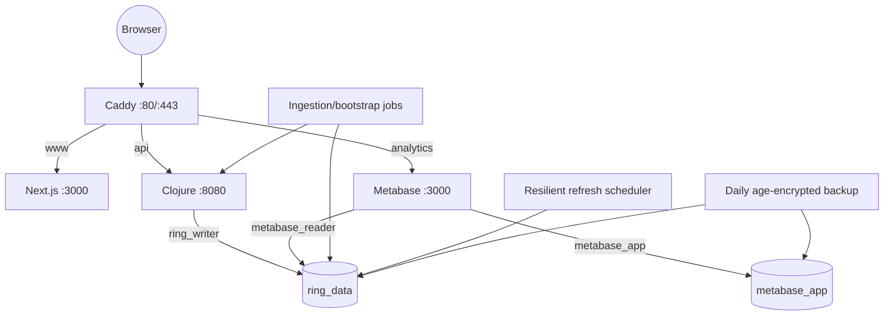
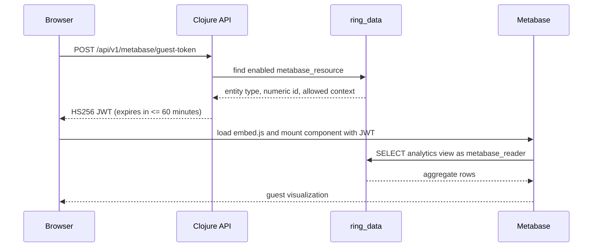

# Architecture

## Goals and boundaries

Restless Pacific has three deliberately separate responsibilities:

1. Clojure turns external records into versioned, queryable evidence and owns
   all public APIs and guest-token signing.
2. Next.js tells the story and renders the purpose-built map experience.
3. Metabase answers repeatable analytical questions from read-only views.

This keeps upstream parsing out of page requests, keeps a business-intelligence
tool out of the cinematic map path, and prevents a visualization account from
acquiring write access to scientific records.

## Container topology



Caddy is the only public service. Diagnostic ports bind to loopback in the
development Compose model. In production, host firewall rules permit only SSH,
HTTP, and HTTPS.

## Data lifecycle

```mermaid
sequenceDiagram
  participant Scheduler
  participant Ingest as Clojure ingestion
  participant Upstream
  participant DB as PostGIS
  participant API as Clojure API
  participant UI as Next.js

  Scheduler->>Ingest: run dataset refresh
  Ingest->>DB: acquire advisory lock
  Ingest->>Upstream: conditional fetch with timeout
  Upstream-->>Ingest: source payload and metadata
  Ingest->>DB: write isolated staging rows
  Ingest->>Ingest: validate IDs, counts, geometry, dates
  alt valid
    Ingest->>DB: atomic upsert and activate version
    Ingest->>DB: record successful ingestion_run
  else malformed or unexpected
    Ingest->>DB: rollback staging transaction
    Ingest->>DB: record failure; retain last good version
  end
  Ingest->>DB: release advisory lock
  UI->>API: bbox/filter request
  API->>DB: bounded spatial query
  API-->>UI: GeoJSON plus provenance
```

Source payloads are not treated as timeless facts. `source_dataset` describes
the upstream dataset and active version; `ingestion_run` records each attempt,
checksum, row counts, timing, and error summary. Domain rows point back to that
evidence.

## Database trust boundaries

| Principal | Database | Access |
|---|---|---|
| `ring_writer` | `ring_data` | Owns application schemas and migrations; reads/writes ingestion and domain data |
| `metabase_reader` | `ring_data` | Connect plus `USAGE`/`SELECT` on `analytics` only; no core, staging, or ops access |
| `metabase_app` | `metabase_app` | Owns Metabase application state; no rights in `ring_data` |
| Postgres administrator | cluster | Initialization, backup, restore, and exceptional operations only |

The `analytics` schema contains stable views optimized for Metabase. Public API
queries use domain tables and spatial indexes; Metabase never acts as the API.

## Read paths

### Atlas GeoJSON

The browser sends a bounded `bbox` and filters to the Clojure API. Reitit
validates and caps the request. PostGIS uses GiST indexes for intersection and
distance work. Results are RFC 7946 longitude/latitude geometries. Pagination
prevents a world view from becoming an unbounded data export.

### Guest analytics



The resource ID in a request is not trusted merely because it is numeric. It
must match the allow-list written by the bootstrap task. Origin policy is
enforced at the API edge. The signing secret exists only in backend and
deployment environments.

## Frontend rendering strategy

Routes and long-form copy render as Server Components by default. MapLibre,
scroll camera behavior, Radix sheets, and Metabase custom elements are isolated
client components. Lazy boundaries reserve dimensions to prevent layout shift.
A text/table representation is available for every map-derived view.

The motion model has three authored behaviors: route drawing, chapter camera
changes, and evidence/detail transitions. `prefers-reduced-motion` replaces
them with static state, and chapter buttons expose the same navigation without
scroll gestures.

## Failure and degradation

| Failure | Behavior |
|---|---|
| Upstream timeout or malformed payload | Roll back; serve the last successful version and expose the failed run in source status |
| Duplicate scheduled ingestion | Advisory-lock loser exits without mutating data |
| Metabase unavailable | Story and atlas remain usable; Data Lab shows a retryable status and sourced text/table context |
| Live earthquake refresh stale | Display the last fetch time prominently; never imply real-time alerting |
| Token expired | Fetch a new allow-listed token and remount the guest component |
| Map tiles unavailable | Preserve chapter copy, evidence tables, citations, and manual navigation |

## Deployment

CI builds immutable backend and web images. A protected GitHub `production`
environment supplies manual approval before the deploy job connects to the VPS.
The host checks out the corresponding commit, pulls the `sha-*` images, validates
Compose, runs migrations/provisioning, and waits for service health. Rollback is
the same operation with the previous image tag.
